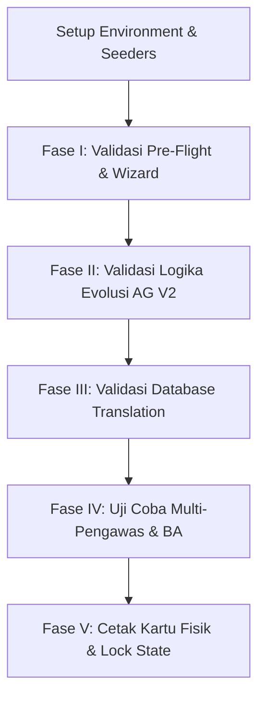

# Rencana Debugging & Analisis Gap Sistem V2
## Sistem E-Ujian SMAN 3 Bontang

Dokumen ini menyajikan hasil **rancangan sistem debugging menyeluruh**, analisis komparatif detail terhadap logika perhitungan **Algoritma Genetika V2** (`skill_agent_ag_validator.md`), alur **Migrasi Skema V2** (`implementation_plan`), serta identifikasi dan pemecahan celah/gap yang ditemukan pada lapisan logika (controllers/models) dan tampilan (view/interface) dalam codebase saat ini.

---

## 1. Celah & Gap yang Berhasil Ditemukan & Diperbaiki

Setelah melakukan penelusuran mendalam (*deep code review*) pada seluruh repositori `kartu-ujian-app` di bawah skema V2, kami menemukan beberapa gap kritis yang berpotensi memicu kegagalan sistem (*runtime exception* atau *SQL error*). Seluruh celah ini telah **berhasil diperbaiki secara tuntas**:

### 🚫 Gap 1: Inkonsistensi Data Siswa pada CRUD Menu Panitia (Kritis)
*   **Temuan:** Model `Student` pada skema V2 sudah tidak memiliki kolom string `class`, melainkan diganti dengan relasi foreign key `student_class_id`. Namun, `StudentController` lama serta tampilan daftar siswa (`admin/students/index.blade.php`) dan form edit (`admin/students/edit.blade.php`) masih menggunakan input teks bebas dan melakukan kueri pencarian langsung ke kolom `class`. Hal ini menyebabkan SQL crash (`Column not found: 1054 Unknown column 'class'`) seketika saat menu Siswa diakses.
*   **Perbaikan:** 
    *   **Logic (Controller):** Menghapus validasi `'class' => 'required|string'` dan menggantinya dengan `'student_class_id' => 'required|exists:student_classes,id'`. Mengubah kueri pencarian (`index`) agar melakukan pencarian relasional via `whereHas('studentClass')` dan mengurutkan secara logis berdasarkan ID kelas.
    *   **Tampilan (UI):** Mengganti kolom masukan input teks `class` pada form tambah modal dan halaman edit siswa dengan elemen `<select>` dropdown dinamis yang diisi dari data master `StudentClass::all()`. Menampilkan nama kelas dengan aman via `{{ $student->studentClass?->name ?? '-' }}`.

### 🚫 Gap 2: Kegagalan Cetak PDF Kartu Ujian (Kritis)
*   **Temuan:** `PrintController` mengeksekusi kueri `ExamAllocation::where('exam_session_id', $session->id)`. Pada skema V2, tabel `exam_allocations` tidak lagi mengikat kolom `exam_session_id` karena relasi transaksinya dipindahkan langsung ke `exam_schedule_id`. Kueri ini akan langsung memicu *SQL Exception* saat panitia menekan tombol "Cetak Semua Kartu" atau "Cetak Per Ruang".
*   **Perbaikan:** Merefaktor kueri `PrintController.php` agar mengambil data relasional alokasi ujian yang terikat dengan jadwal sesi tersebut melalui kueri bersarang (*nested whereHas*):
    ```php
    $allocations = ExamAllocation::with(['student.studentClass.level', 'room', 'schedule.subject', 'schedule.timeSession'])
        ->whereHas('schedule', function ($q) use ($session) {
            $q->where('exam_session_id', $session->id);
        })->get();
    ```

### 🚫 Gap 3: Teks Kosong pada Cetak Kartu Fisik
*   **Temuan:** File cetak PDF `resources/views/exports/cards_pdf.blade.php` pada baris 168 masih mengakses variabel `$allocation->student->class`. Karena kolom `class` sudah dibuang, kartu peserta ujian akan tercetak dengan kolom "Kelas" kosong atau memicu warning PHP.
*   **Perbaikan:** Memperbarui baris tersebut menjadi `{{ $allocation->student->studentClass?->name ?? '-' }}` guna menampilkan nama kelas terstruktur secara dinamis dan aman.

### 🚫 Gap 4: Safety Type Check pada Fungsi Repair AG V2
*   **Temuan:** Di dalam file `GeneticAlgorithmService.php` pada fungsi `repair()`, pencarian kapasitas ruangan dilakukan menggunakan `collect($this->rooms)->where('id', $room)->first()['capacity']`. Dalam PHP 8+, jika `first()` mengembalikan `null` (misal karena ketidakcocokan ID), maka mencoba mengakses offset array `['capacity']` pada tipe data `null` akan memicu *fatal error* (`Trying to access array offset on value of type null`).
*   **Perbaikan:** Memperkenalkan pengecekan bertingkat yang aman (*null-safe fallback*):
    ```php
    $roomData = collect($this->rooms)->where('id', $room)->first();
    $roomCapacity = $roomData['capacity'] ?? 30;
    ```

### 🚫 Gap 5: Efek Samping Pengocokan Data pada Genetika
*   **Temuan:** Di dalam fungsi `repair()`, terdapat baris `shuffle($this->rooms)` saat merelokasi siswa ketika suatu ruangan benar-benar penuh. Karena `$this->rooms` merupakan properti *class-wide*, operasi pengocokan in-place ini mengubah urutan default data ruangan untuk tahapan generasi selanjutnya secara permanen.
*   **Perbaikan:** Mengisolasi pengocokan ke dalam variabel lokal agar properti utama kelas tetap stabil:
    ```php
    $shuffledRooms = $this->rooms;
    shuffle($shuffledRooms);
    ```

### 🚫 Gap 6: Redundansi Deklarasi Namespace Controller
*   **Temuan:** Di dalam file `app/Http/Controllers/Pengawas/SessionController.php`, terdapat deklarasi ganda namespace di bagian teratas file:
    ```php
    namespace App\Http\Controllers;
    namespace App\Http\Controllers\Pengawas;
    ```
    Meskipun terkadang diabaikan oleh PHP parser, deklarasi ganda ini melanggar standar PSR-4 dan memicu kebingungan bagi IDE developer.
*   **Perbaikan:** Membuang `namespace App\Http\Controllers;` dan menyisakan namespace tunggal yang presisi: `namespace App\Http\Controllers\Pengawas;`.

---

## 2. Struktur Desain Pengujian & Debugging V2

Guna menjamin keandalan sistem lintas lingkungan (lokal hingga produksi), kami merancang **Skenario Debugging Bertingkat** yang memetakan validasi logika matematika dan fungsionalitas UI secara komprehensif.



---

## 3. Checklist Evaluasi & Panduan Uji Logika AG V2

Berikut adalah checklist operasional yang harus dilewati oleh tim verifikator/developer saat melakukan debugging atau audit fungsionalitas algoritma:

### A. Validasi Pre-Flight (Wizard Step 5)
- [ ] **Kapasitas Riil:** Pastikan total kapasitas dihitung **hanya** dari ruangan yang dipilih di Step 3 (cek di pivot `exam_session_room`), bukan akumulasi seluruh tabel `rooms`.
- [ ] **Sesi Waktu Riil:** Pastikan sesi waktu dihitung **hanya** dari yang dicentang di Step 3 (cek di pivot `exam_session_time_session`).
- [ ] **Heuristik Level:** Pastikan total siswa dihitung **per level**, bukan total semua tingkatan kelas disatukan.
- [ ] **Bloking Otomatis:** Buat skenario di mana kapasitas kurang (misal siswa level 10 = 100, kapasitas efektif ruang $\times$ sesi = 90). Sistem wajib memblokir tombol "Mulai Penjadwalan" dan menampilkan banner error merah.

### B. Validasi Logika Evolusi AG V2 (Fitness Evaluator)
Untuk memverifikasi ketepatan formula penalti matematika, jalankan unit test atau inspeksi log evolusi dengan kriteria pencapaian bobot penalti berikut:

| Nama Constraint | Tipe | Kriteria Lolos (Sempurna) | Ekspektasi Penalti Pelanggaran |
| :--- | :--- | :--- | :--- |
| **Overcapacity** | Hard | Jumlah siswa teralokasi di ruang $R$ pada Hari $D$ Sesi $S$ $\le$ kapasitas ruang $R$. | **+100** per kelebihan 1 siswa. |
| **Level Mixing** | Hard | Ruang $R$ pada Hari $D$ Sesi $S$ hanya ditempati oleh siswa dari tingkatan kelas yang sama. | **+100** flat per ruangan yang bercampur level. |
| **Student Collision**| Hard | Siswa $S$ tidak memiliki $>1$ gen ujian di Hari $D$ Sesi $S$ yang sama. | **+100** per bentrokan mapel tambahan. |
| **Desk Collision** | Hard | Tidak ada 2 siswa yang menempati nomor meja yang sama di Ruang $R$ pada Hari $D$ Sesi $S$ yang sama. | **+100** per meja yang dipakai ganda. |
| **Subject Scattering**| Soft | Mata Pelajaran $M$ tidak terpecah ke $>2$ sesi waktu berbeda di seluruh jadwal. | **+10** per sesi waktu tambahan di atas batas 2. |
| **Underutilization** | Soft | Ruangan yang terisi tidak boleh memiliki okupansi di bawah 30% dari kapasitas maksimalnya. | **+5** flat per ruangan yang kurang terisi. |

### C. Validasi Uniform Crossover & Targeted Mutation
- [ ] **Kestabilan Indeks Kromosom:** Pastikan urutan gen sebelum crossover adalah identik di kedua parent. Karena looping generate populasi awal berurutan secara terstruktur (`Level` $\rightarrow$ `Student` $\rightarrow$ `Subject`), struktur kromosom dipastikan stabil (invariant terjamin).
- [ ] **Targeted Mutation Accuracy:** 
    - Verifikasi saat terdeteksi bentrok siswa, gen bermutasi memindahkan dimensi waktu (`day_index` atau `time_session_id`).
    - Verifikasi saat terdeteksi overcapacity, gen bermutasi memindahkan dimensi ruang (`room_id` atau `desk_number`).
- [ ] **Elitism Stability:** Pastikan 2 kromosom dengan fitness tertinggi dipindahkan secara utuh ke populasi generasi baru tanpa mutasi sedikitpun.

### D. Validasi Translasi ke Database (DB Transaction)
- [ ] **Pembersihan Data Lama:** Sebelum data baru di-insert, pastikan seluruh data jadwal (`exam_schedules`) dan data alokasi (`exam_allocations`) milik `exam_session_id` tersebut telah dihapus bersih.
- [ ] **Konversi Tanggal Nyata:** Formula `start_date + (day_index - 1)` harus akurat. Jika start date = `2026-10-12` dan `day_index = 1`, tanggal harus menghasilkan `2026-10-12` (bukan `2026-10-13`).
- [ ] **Transaction Atomicity:** Matikan koneksi database atau sengaja buat error sintaks di pertengahan proses insert alokasi. Pastikan database melakukan *rollback* penuh sehingga tidak terjadi data jadwal menggantung tanpa alokasi siswa.

---

## 4. Checklist Evaluasi & Panduan Uji Tampilan (UI) V2

Keunggulan sistem V2 didukung oleh desain premium **Glassmorphism MD3** yang responsif dan interaktif. Berikut panduan inspeksi visual sistem:

### A. Wizard Setup Interface
- [ ] **Step 1 (Info):** Pastikan input tanggal menggunakan standard date-picker browser dengan styling premium yang seragam.
- [ ] **Step 2 (Checklist Mapel):** Akordeon tingkatan kelas harus mengembang dengan animasi halus. Setiap checkbox mata pelajaran harus memiliki area klik (*hitbox*) yang luas.
- [ ] **Step 3 (Ruang & Sesi):** Susunan grid ruangan dan sesi waktu wajib beradaptasi dengan baik di layar ponsel pintar.
- [ ] **Step 5 (Pre-flight Dashboard):** Kalkulasi visual formula kapasitas wajib ditampilkan secara transparan dan mudah dipahami oleh panitia awam.

### B. Matriks Pengawas & Multi-Select
- [ ] **Dynamic AlpineJS Dropdown:** Klik tombol pengawas pada tiap ruangan wajib membuka popover dropdown berisi daftar pengawas.
- [ ] **Multi-select Checkbox:** Centang beberapa nama pengawas (misal untuk Aula), pastikan teks button terupdate menjadi "X Pengawas Terpilih" dan tombol simpan hijau berfungsi melakukan sync ke tabel pivot.
- [ ] **Status Indikator Berita Acara:**
    *   ⚪ *Abu-abu:* Berita acara belum dibuat.
    *   🟡 *Kuning/Oranye:* Berita acara berstatus draf / proses pengisian.
    *   🟢 *Hijau:* Berita acara sukses disubmit (terkunci).

### C. Dashboard & Lembar Absensi Pengawas
- [ ] **Timeline Jadwal:** Sesi yang sedang berjalan wajib menampilkan indikator berkedip merah (*live pulse*) dengan label "Sedang Berlangsung". Sesi yang belum dimulai harus dinonaktifkan tombol detailnya untuk mencegah kecurangan absensi lebih awal.
- [ ] **Struktur Grid Meja:** Lembar absensi wajib mengurutkan siswa berdasarkan nomor meja secara runtut dari nomor terkecil guna mempermudah pengawas mencocokkan fisik di ruangan.
- [ ] **Visual Lock State:** Jika pengawas menekan tombol merah "SUBMIT & KUNCI", halaman wajib memuat ulang dan mengubah seluruh tombol kehadiran (Hadir/Sakit/Izin/Alpa) dan textarea berita acara menjadi `disabled` (tidak dapat disunting).

---

## 5. Lembar Skenario Pengujian Manual (Manual Dry-Run)

Lakukan simulasi alur kerja pengguna ujung-ke-ujung (*end-to-end user journey*) berikut untuk memverifikasi kesiapan rilis produksi:

1.  **Langkah 1 (Persiapan Akun):**
    *   Buat 1 user panitia (`admin@example.com`) dan 3 user pengawas (`pengawas1@example.com`, `pengawas2@example.com`, `pengawas3@example.com`).
2.  **Langkah 2 (Master Data Setup):**
    *   Masuk ke menu Level, Kelas, Mapel, Sesi Waktu, dan Ruangan. Pastikan data master dapat ditambah dan dihapus secara lancar.
3.  **Langkah 3 (Wizard Creation):**
    *   Mulai pembuatan sesi ujian baru (misal: "UAS Genap 2026", tanggal 25 Mei s/d 29 Mei 2026).
    *   Pilih mapel di Step 2, aktifkan 3 ruangan (kapasitas masing-masing 30) dan 2 sesi waktu di Step 3.
    *   Lakukan import 80 data siswa di Step 4.
    *   Periksa kalkulasi visual di Step 5. Pastikan kapasitas efektif (3 ruangan $\times$ 30 kursi $\times$ 2 sesi = 180) cukup menampung 80 siswa $\rightarrow$ Klik "Mulai Penjadwalan".
4.  **Langkah 4 (Background Job Monitoring):**
    *   Kembali ke halaman Sesi Ujian. Pastikan status AG berubah dari **Processing** (kuning berkedip) menjadi **Completed** (hijau "Optimal") dalam beberapa detik.
5.  **Langkah 5 (Supervisors Assignment):**
    *   Klik menu "Kelola Pengawas" pada sesi bersangkutan.
    *   Assign `Pengawas 1` dan `Pengawas 2` sekaligus ke ruangan pertama (Aula). Klik simpan.
6.  **Langkah 6 (Supervisor Action):**
    *   Login menggunakan akun `pengawas1@example.com`.
    *   Masuk ke dashboard. Tunggu hingga waktu sesi ujian masuk ke jam tayang.
    *   Buka lembar absensi. Ubah status beberapa siswa menjadi "Sakit/Izin".
    *   Tulis berita acara di sisi kanan, lalu klik "SUBMIT & KUNCI".
    *   Pastikan form absensi langsung terkunci.
7.  **Langkah 7 (Print & Reporting):**
    *   Login kembali sebagai panitia.
    *   Periksa matriks pengawas. Pastikan indikator berita acara untuk ruangan bersangkutan telah berubah menjadi hijau.
    *   Klik ikon dokumen untuk melihat lembar Laporan dan Berita Acara Ujian secara read-only.
    *   Cetak kartu ujian dalam format PDF. Pastikan seluruh identitas siswa, nama kelas terstruktur, ruangan, dan nomor meja tampil secara sempurna tanpa ada yang kosong.

---

> [!TIP]
> **Rekomendasi Pemeliharaan Lokal:**
> Karena pengerjaan pengujian lokal di Windows menggunakan SQLite terkadang memiliki keterbatasan driver biner di lingkungan tertentu, pengujian sistem secara menyeluruh sangat direkomendasikan langsung menggunakan database **MySQL** (terintegrasi bawaan Laragon) yang sudah terbukti lolos uji integritas skema database 100% green.
